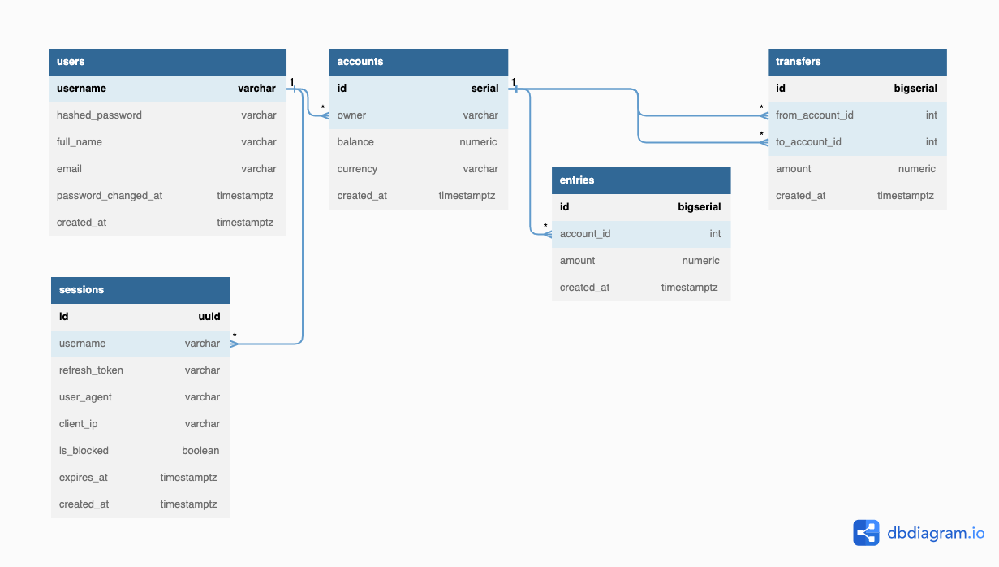

# Description

## Key skills practiced

Clean Architecture; REST API (inc. OpenAPI, [API design guide](https://cloud.google.com/apis/design)); Unit and Integration tests; Go Style Best Practices (inc. [Google Go Style](https://google.github.io/styleguide/go/index), [Standard Go Project Layout](https://github.com/golang-standards/project-layout)); CI/CD (Run tests, linters and deploy the containerized app to Amazon Elastic Container Registry (ECR))

## Features

This bank service provides APIs for the frontend to do the following things:
1. Create and login users
2. Create, get and list users own accounts of different currencies
3. Transfer money between two accounts with recording all balance changes in account entries

## Authorization rules 

1. Users can create an account only for themselves
2. Users can get accounts that only they own
3. Users can list accounts that only belong to them
4. Users can send money only from their own account 
5. Users can only refresh their own access token

## Data model


## OpenAPI Specification

https://go-petr.github.io/pet-bank/

# How to run

## Locally

```
docker-compose -f deployments/docker-compose.yaml up
```
