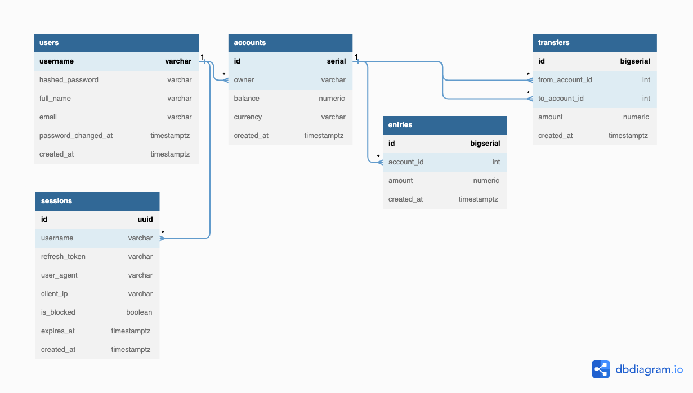

# Description

## Features

This bank service provides APIs for the frontend to do the following things:
1. Create and login users
2. Create, get and list users own accounts of different currencies
3. Transfer money between two accounts with recording all balance changes in account entries

## Authorization rules 

1. user can create an account only for him/herself
2. user can get accounts that only he/she owns 
3. user can list accounts that only belong to him/her
4. user can send money only from his/her own account 
5. user can only refresh his/her own access token

## Data model


## OpenAPI Specification

https://go-petr.github.io/pet-bank/

# How to run

## Localy

```
docker-compose -f deployments/docker-compose.yaml up
```
